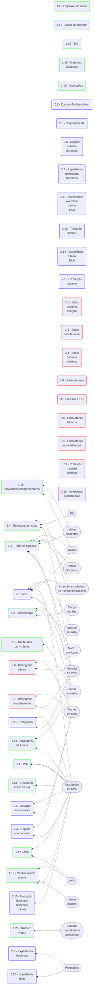

```mermaid
flowchart RL

%%	subgraph Dimensão 1
%%		direction RL
	    id1.1(1.1 - PDI):::green
		id1.2(1.2 - Objetivos do curso):::green
		id1.3(1.3 - Perfil do egresso):::green
		id1.4(1.4 - Estrutura curricular):::green
		id1.5(1.5 - Conteúdos curriculares):::green
		id1.6(1.6 - Metodologia):::green
		id1.10(1.10 - Atividades\complementares):::green
		id1.12(1.12 - Apoio ao discente):::green
		id1.13(1.13 - Gestão do\ncurso e CPA):::green
		id1.14(1.14 - Atividades\nda tutoria):::green
		id1.15(1.15 - Conhecimento\ntutoria):::green
		id1.16(1.16 - TIC):::green
		id1.17(1.17 - AVA):::green
		id1.18(1.18 - Materiais\nDidáticos):::green
		id1.19(1.19 - Avaliações):::green
		id1.20(1.20 - Número\nvagas):::green

%%	end
%%	subgraph Dimensão 2
		direction RL
		id2.1(2.1 - NDE):::blue
		id2.2(2.2 - Equipe Multidisciplinar):::blue
		id2.3(2.3 - Atuação\ncoordenador):::blue
		id2.4(2.4 - Regime\ncoordenador):::blue
		id2.5(2.5 - Corpo docente):::blue
		id2.6(2.6 - Regime\ntrabalho\ndocentes):::blue
		id2.7(2.7 - Experiência\nprofissional\ndocentes):::blue
		id2.9(2.9 - Experiência\ndocência):::blue
		id2.10(2.10 - Experiência\nEAD):::blue
		id2.11(2.11 - Experiência\nexercício\ntutoria\nEAD):::blue
		id2.12(2.12 - Colegiado):::blue
		id2.13(2.13 - Titulação\ntutores):::blue
		id2.14(2.14 - Experiência\ntutoria\nEAD):::blue
		id2.15(2.15 - Interação\ndocentes\ndiscentes\ntutores):::blue
		id2.16(2.16 - Produção\ndocente):::blue
%%	end
%%	subgraph Dimensão 3
		direction RL
		id3.1(3.1 - Salas\ndocente\nintegral):::red
		id3.2(3.2 - Salas\ncoordenador):::red
		id3.3(3.3 - Salas\ndocente\ncoletiva):::red
		id3.4(3.4 - Salas de aula):::red
		id3.5(3.5 - Acesso à TIC):::red
		id3.6(3.6 - Bibliografia\nbásica):::red
		id3.7(3.7 - Bibliografia\ncomplementar):::red
		id3.8(3.8 - Laboratórios\nbásicos):::red
		id3.9(3.9 - Laboratórios\nespecializados):::red
		id3.14(3.14 - Produção\nmaterial\ndidático):::red
		id3.18(3.18 - Ambientes\nprofissionais):::red
%%	end
		txtMPPC([Menção\nno PPC])
		txtPLEN([Planos\nde ensino])
		txtCPAR([Resultados\nde CPA])
		txtINSE([Inserção estudantes\n no mundo de trabalho])
		txtDCNS([DCNs])
		txtFELE([FE])
		txtCHOR([Carga\nhorária])
		txtMATR([Matriz\ncurricular])
		txtAVA([AVA])
		txtESQT([Estudos\nquantitativos\nqualitativos])
		txtPLAN([Planos\nde ação])
		txtATAS([Atas de\nreunião])
		txtPROD([Produções])
	
		relDISC([relatos\ndiscentes])
		relDOSC([relatos\ndocentes])
		relTUTO([relatos\ntutores])
	
	
		txtCPAR --> id1.1
	
		txtMPPC -.-> id1.3
		txtPLEN -.-> id1.3	
		relDISC -.-> id1.3
		relDOSC -.-> id1.3
		txtINSE -.-> id1.3
		txtDCNS -.-> id1.3
	
		txtMPPC -.-> id1.4
		txtFELE -.-> id1.4
		txtCHOR -.-> id1.4
	
		txtPLEN -.-> id1.5
	
		txtCHOR -.-> id1.6
		txtPLEN -.-> id1.6
		txtMATR -.-> id1.6
	
		txtDCNS -.-> id1.10
		relDISC -.-> id1.10
	
		txtCPAR -.-> id1.13
	
		txtCPAR -.-> id1.14
		txtPLEN -.-> id1.14
	
		txtCPAR -.-> id1.15
		relTUTO -.-> id1.15
		txtAVA -.-> id1.15
	
		txtAVA -.-> id1.17
		txtCPAR -.-> id1.17
	
		txtESQT -.-> id1.20
	
		txtMPPC -.-> id2.1
		txtCPAR -.-> id2.1
		txtDCNS -.-> id2.1
		txtINSE -.-> id2.1
		txtATAS -.-> id2.1
	
		txtPLAN -.-> id2.3
		txtCPAR -.-> id2.3
	
		txtCPAR -.-> id2.4
		txtPLAN -.-> id2.4
	
		txtPROD -.-> id2.9
		txtPROD -.-> id2.10
	
		txtMPPC -.-> id2.12
		txtCPAR -.-> id2.12
	
		txtCPAR -.-> id2.15
	
		txtMPPC -.-> id3.6
		txtPLAN -.-> id3.6
		txtMPPC -.-> id3.7
		txtPLAN -.-> id3.7

	click id1.1 href "obsidian://open?vault=Obsidian&file=00-09%20Meta%2F03%20Templates%2F03.03%20Obsidian%2FINEP%2FINEP%20!%201.1%20Pol%C3%ADticas%20institucionais%20no%20%C3%A2mbito%20do%20curso%20(AR)" _blank

classDef red stroke:#f00 
classDef green stroke:#0f0 
classDef blue stroke:#00f
```
