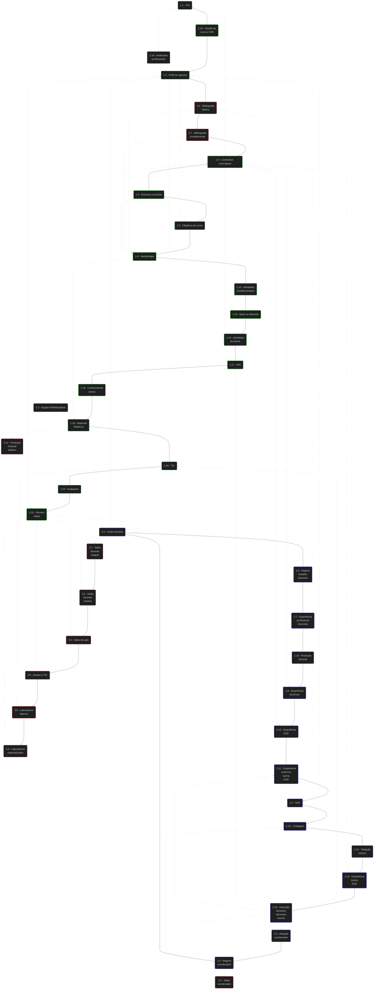

# Dependências entre indicadores para análise

```mermaid
%%{init: {'theme': 'dark'}}%%
flowchart TD
    id1.1(1.1 - PDI):::green
	id1.2(1.2 - Objetivos do curso):::green
	id1.3(1.3 - Perfil do egresso):::green
	id1.4(1.4 - Estrutura curricular):::green
	id1.5(1.5 - Conteúdos curriculares):::green
	id1.6(1.6 - Metodologia):::green
	id1.10(1.10 - Atividades\ncomplementares):::green
	id1.12(1.12 - Apoio ao discente):::green
	id1.13(1.13 - Gestão do\ncurso e CPA):::green
	id1.14(1.14 - Atividades\nda tutoria):::green
	id1.15(1.15 - Conhecimento\ntutoria):::green
	id1.16(1.16 - TIC):::green
	id1.17(1.17 - AVA):::green
	id1.18(1.18 - Materiais\nDidáticos):::green
	id1.19(1.19 - Avaliações):::green
	id1.20(1.20 - Número\nvagas):::green

	id2.1(2.1 - NDE):::blue
	id2.2(2.2 - Equipe Multidisciplinar):::blue
	id2.3(2.3 - Atuação\ncoordenador):::blue
	id2.4(2.4 - Regime\ncoordenador):::blue
	id2.5(2.5 - Corpo docente):::blue
	id2.6(2.6 - Regime\ntrabalho\ndocentes):::blue
	id2.7(2.7 - Experiência\nprofissional\ndocentes):::blue
	id2.9(2.9 - Experiência\ndocência):::blue
	id2.10(2.10 - Experiência\nEAD):::blue
	id2.11(2.11 - Experiência\nexercício\ntutoria\nEAD):::blue
	id2.12(2.12 - Colegiado):::blue
	id2.13(2.13 - Titulação\ntutores):::blue
	id2.14(2.14 - Experiência\ntutoria\nEAD):::blue
	id2.15(2.15 - Interação\ndocentes\ndiscentes\ntutores):::blue
	id2.16(2.16 - Produção\ndocente):::blue

	id3.1(3.1 - Salas\ndocente\nintegral):::red
	id3.2(3.2 - Salas\ncoordenador):::red
	id3.3(3.3 - Salas\ndocente\ncoletiva):::red
	id3.4(3.4 - Salas de aula):::red
	id3.5(3.5 - Acesso à TIC):::red
	id3.6(3.6 - Bibliografia\nbásica):::red
	id3.7(3.7 - Bibliografia\ncomplementar):::red
	id3.8(3.8 - Laboratórios\nbásicos):::red
	id3.9(3.9 - Laboratórios\nespecializados):::red
	id3.14(3.14 - Produção\nmaterial\ndidático):::red
	id3.18(3.18 - Ambientes\nprofissionais):::red
	
	
	id1.1 <===> id1.13 ====> id1.3 <====> id3.6 ===> id3.7 ===> id1.5 <====> id1.4 <====> id1.2 ====> id1.6 ====> id1.10 ===> id1.12 ===> id1.14 ===> id1.17 ===> id1.15 ===> id1.18 ===> id1.16 ===> id1.19 ===> id1.20

	id2.3 ===> id2.4 ===> id2.5 ===> id2.6 ===> id2.7 ===> id2.16 ===> id2.9 ===> id2.10 ===> id2.11 ===> id2.1 ===> id2.12 ===> id2.13 ===> id2.14 ===> id2.15 

	id3.1 ===> id3.3 ===> id3.4 ===> id3.5 ===> id3.8 ===> id3.9

	id1.1 -.-> id3.18
	id1.1 <-.-> id1.5
	id1.3 -.-> id2.1 -.-> id2.12
	id1.3 -.-> id1.6	
	id1.3 -.-> id1.2
	id1.3 <-.-> id1.20
	id1.5 -.-> id1.14	
	id1.5 -.-> id2.9 
	id1.5 -.-> id2.14
	id1.5 -.-> id2.10
	id1.5 <-.- id3.6
	id1.6 -.-> id1.18
	id1.6 <-.-> id1.4
	id1.6 <-.-> id1.5
	id1.18 -.-> id3.14
	id1.20 <-.-> id2.5

	id2.1 -.-> id3.6
	id2.2 -.-> id1.18
	id2.4 -.-> id3.2
	id2.5 -.-> id1.3
	id2.5 -.-> id3.1
	id2.5 -.-> id3.3
	id2.12 -.-> id2.4
	id2.15 -.-> id2.3
	id2.15 -.-> id2.4
	id2.15 -.-> id1.16
	id2.15 -.-> id1.17
	id2.15 -.-> id2.11

	id3.4 -.-> id1.20
	id3.5 -.-> id1.20
	id3.5 -.-> id1.16
	id3.6 -.-> id1.6
    id3.7 -.-> id1.6
	id3.8 -.-> id1.20
	id3.9 -.-> id1.20
	id3.18 -.-> id1.3

classDef red stroke:#f00 
classDef green stroke:#0f0 
classDef blue stroke:#00f
```
